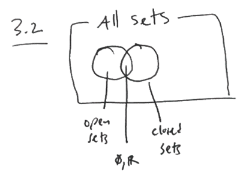
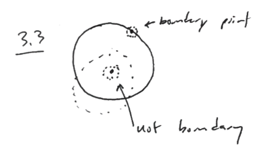
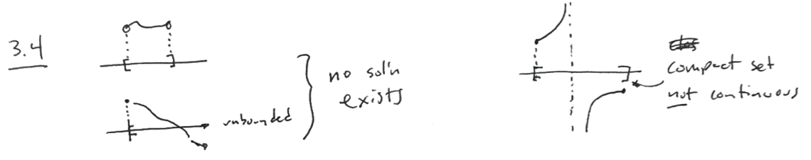
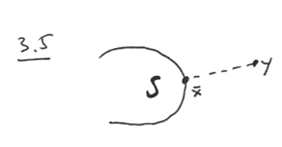
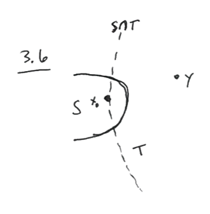
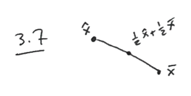

---
title:  'Nonlinear Optimization Lecture 3'
date: January 19, 2016
author: Garrick Aden-Buie
...

# Last time

- Convex functions and Convex sets ==> convex optimization
- $\epsilon$-neighborhood (open ball)
- open sets
- closed sets

# Some vocabulary

## Interior of a set $S$

The interior of a set, $\mathrm{Int} (S) = \{x \in S \colon \exists \epsilon > 0, N_{\epsilon} (x) \subset S \}$. The interior of a closed set is just the open set having removed the boundary.

Observation: $S$ *is open* $\Leftrightarrow S = \mathrm{Int} (S)$.

Notes: $\Leftrightarrow$ means Iff. or equivalent. $A \Rightarrow B$ is A implies B, $A \Leftarrow B$ is B implies A.

$\mathbb{R}$ is open by definition of open sets, and $\emptyset$ is closed because $\emptyset^C = \mathbb{R}$ is open. But $\mathrm{Int} (\emptyset) = \emptyset$ so $\emptyset$ is open. And then $\mathbb{R}^C$ is open so $\mathbb{R}$ is closed by the same logic. Thus $\mathbb{R}$ and $\emptyset$ are both open and closed (so neither are *well-defined*: *clopen set*).

A set that has a partial boundary is neither closed nor open (See **Fig. 3.1**).

**Fig. 3.2**: venn diagram of sets

## Boundary points

A point, $x$, is a **boundary point** of $S$ if for each $\epsilon > 0$, the $\epsilon$ neighborhood $N_{\epsilon}(x)$ contains a point in $S$ and a point not in $S$.

## Boundary of S

The **boundary** of $S = \delta S =$ set of all boundary points.

## Closure of S

The closure of $S = C\ell (S) = S \cup \delta S$. $S$ is closed iff. $S = C\ell (S)$.

## Bounded sets

- Let $S \subset \mathbb{R}^n$
- $S$ is **bounded** if $\exists m > 0, m \in \mathbb{R}$
- such that $\Vert x \Vert \leq m, \forall x \in S$
- (norm: $\sqrt{x_1^2 + x_2^2 + x_3^2 + \dots}$)

## Compact sets

A set $S \subset \mathbb{R}^n$ is **compact** if it is closed and bounded.

# Weirstrass Theorem

Weirstrass Theorem
:    A continuous function defined on a non-empty compact set, attains a minimum on the set.

(compact = closed and bounded)

This is the typical form, but let's consider the form most useful to this class:

$$\begin{aligned}
\text{min}	&f(x)	& 	& \\
\text{s.t}	&x \in X		&	& \\
\end{aligned}$$

If $f$ is continuous and $X$ is compact, then *there exists* an optimal solution.

**Fig 3.4**: Compact and unbounded sets that cause problems and break things.

In LP, *continuous* is less of a worry because *linear* functions are continuous, but in NLP both *compact* and *continuous* are a big deal. (Although depending on the way in which a function is not continuous, it may not matter.)

# Minimum Distance point

Theorem
:    Let $S$ be a non-empty closed, convex subset of $\mathbb{R}^n$. Let $y \not\in S$. Then there exists the unique point $\bar{x} \in S$ that is closest to $y$.

    Furthermore $(y - \bar x)^T (x - \bar x) \leq 0$, $\forall x \in S$.

**Fig. 3.5**: Example of $S, \bar x, y$.

## Proof

$\bar x$ is a solution of

$$\begin{aligned}
\text{min}_x	&\Vert y-x\Vert	& 	& \\
\text{s.t}	&x \in S		&	& \\
\end{aligned}$$

**Existence.** We haven't assumed that $S$ is bounded. Let $T = \{x \in \mathbb{R}^n \colon \Vert y - x\Vert \leq \Vert y - x_0\Vert \}$, see **Fig. 3.6**.

By doing this, we can change this problem to

$$\begin{aligned}
\text{min}	&\Vert y - x \Vert	& 	& \\
\text{s.t}	&x \in S \cap T		&	& \\
\end{aligned}$$

Then, by the Weirstrass Theorem, $\bar x$ exists, because $S \cap T$ is compact.

**Uniqueness.**

This proves existence, but we need to now prove uniqueness, which is often done via contradiction. Also notice that *convexity* in the theorem must play a key role in the proof (or it wouldn't have been in the theorem.)

First, suppose that $\bar x$ is not unique, i.e. $\exists \hat x \in S, \hat x \neq \bar x$ such that $\Vert y - \bar x \Vert = \Vert y - \hat x \Vert$.

(There's another point $\hat x$ that is the same distance from $y$ as $\bar x$.)

Since S is convex, consider $\frac 1 2 \hat x + \frac 1 2 \bar x \in S$.

Then $$\lVert y - (\frac 1 2 \bar x + \frac 1 2 \hat x) \rVert \leq \frac 1 2 \Vert y - \bar x \Vert + \frac 1 2 \Vert y - \hat x \Vert$$ by the triangle inequality, but this is the same as $$\Vert y - \bar x \Vert$$ by the above definition. But then notice that if the $<$ holds, that $\bar x$ is not a solution.

$$\Vert y - (\frac 1 2 \bar x + \frac 1 2 \hat x) \Vert = \Vert y - \bar x \Vert$$

See **Fig. 3.7** that under these conditions, $y$ must be on a line between $\hat x$ and $\bar x$ if they are not the same point.

Let $(y - \bar x) = \lambda (y - \hat x)$ for some $\lambda$. From $\Vert y - \bar x \Vert = \Vert y - \hat x \Vert$ we know that $\lambda = +1$ or $-1$.

If $\lambda = +1$, then

$$\begin{aligned}
y - \bar x = y - \hat x \\
\Rightarrow \bar x = \hat x
\end{aligned}$$

If $\lambda = -1$, then

$$\begin{aligned}
y - \bar x = -(y - \hat x) \\
\Rightarrow y = \frac{\bar x - \hat x}{2} \in S
\end{aligned}$$

Contradition! $\bar x$ must be unique.

**Futhermore...** $S$ is convex $\Rightarrow \bar x + \lambda (x - \bar x) \in S$, $\forall \lambda \in [0, 1]$.

And also, we know that

$$\begin{aligned}
\Vert y - (\bar x + \lambda(x - \bar x)) \Vert &\geq \Vert y - \bar x \Vert,\;\forall \lambda \in [0,1] \\
\Vert y - (\bar x + \lambda(x - \bar x)) \Vert^2 &= \Vert y - \bar x \Vert^2 + \lambda^2 \Vert x - \bar x \Vert^2 - 2\lambda(y-\bar x)^T (x - \bar x)
\end{aligned}$$

Therefore,
$$\begin{aligned}
\lambda^2 \Vert x - \bar x \Vert^2 - 2\lambda (y - \bar x)^T (x - \bar x) \geq 0 \\
\Rightarrow (y - \bar x)T (x - \bar x) \leq \frac \lambda 2 \Vert x - \bar x \Vert^2,\;\forall \lambda \in [0,1], x \in S
\end{aligned}$$

Pick $\lambda =0 \Rightarrow (y - \bar x)^T (x - \bar x) \leq 0$, $\forall x \in S$.
