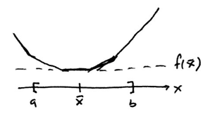
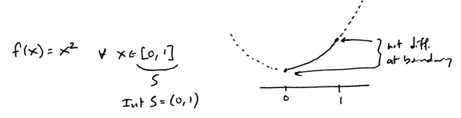
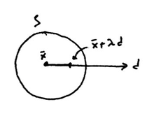
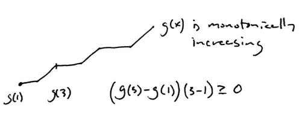

---
title:  'Nonlinear Optimization Lecture 5'
date: Tuesday, January 26, 2016
author: Garrick Aden-Buie
...

# Taylor Expansion

## First-order mean value theorem

(1) Let $f \colon \mathbb{R} \to \mathbb{R}$ and $f$ is differentiable, then there exists $\hat x = \lambda x^\prime + (1 - \lambda)x^2$ for some $\lambda \in (0,1)$ such that $$f^\prime (\hat x) = \frac{f(x^\prime) - f(x^2)}{x^\prime - x^2}$$

$$\Rightarrow f(x^\prime) = f(x^2) + (x^\prime - x^2)f^\prime(\hat x)$$

or $x^\prime = x$ and $x^2 = \bar x$, then

$$f(x) = f(\bar x) + (x - \bar x)f^\prime(\hat x)$$

(2) Let $f \colon \mathbb{R}^n \to \mathbb{R}$ and $f$ is differentiable, then there exists $\hat x = \lambda x + (1 - \lambda)\bar x$ for some $\lambda \in (0,1)$ such that $$f(x) = f(\bar x) + (x - \bar x)^T \nabla f(\hat x)$$

## Second-order Mean Value Theorem

Let $f \colon \mathbb{R}^n \to \mathbb{R}$ and $f$ is twice-differentiable, $f \in C^2$,^[$C^0$ is the set of continuous functions, $C^1$ is the set of differentiable functions, and $C^2$ is the set of twice-differentiable functions.] then there exists $\hat x = \lambda x + (1 - \lambda)\bar x$ for some $\lambda \in (0,1)$ such that

*Class notes:*

$$\begin{aligned}
f(x) &= f(\bar x) &+ (x - \bar x)^T \nabla f(\bar x) &+ (x - \bar x)^T H(\hat x)(x - \bar x) \\
f(x) &= f(\bar x) &+ (x - \bar x)^T \nabla f(\bar x) &+ (x - \bar x)^T H(\bar x)(x - \bar x) \\
&= \cdots &+ \bar x &+ \cdots
\end{aligned}$$

*As stated in the book, Appendix 1*.

The *second-order form* of Taylor's Theorem is stated as for every $x, \bar x \in S$ we must have

$$f(x) = f(\bar x) + (x - \bar x)^T \nabla f(\bar x) + \frac 1 2 (x - \bar x)^T \mathbf{H}(\hat x)(x - \bar x)$$

where $\mathbf{H}(\hat x)$ is the Hessian of $f$ at $\hat x$ and where $\hat x = \lambda x + (1 - \lambda) \bar x$ for some $\lambda \in (0,1)$.

## Subgradient

Let $S \subset \mathbb{R}^n$ be convex, $S \neq \emptyset$ and $f \colon S \to \mathbb{R}$ be convex.

**Definition:** A vector $\xi \in \mathbb{R}^n$ is a *subgradient* of $f$ at $\bar x \in S$ if $f(x) \geq f(\bar x) + \xi^T (x - \bar x),\;\forall x \in S$.

**Theorem.** For $S \subset \mathbb{R}^n,\; S \neq \emptyset$ and $f \colon S \to \mathbb{R}$ (convex).

For $\bar x \in \mathrm{Int} S$, there exists a vector $\xi$ such that the hyperplane $$H = \{ (x,y) \colon y = f(\bar x) \xi^T (x - \bar x) \}$$ supports the epigraph of f -- $\mathrm{epi} f$ -- at $(\bar x, f(\bar x))$.

In particular, $$f(x) \geq f(\bar x) + \xi^T (x - \bar x)\; \forall x \in S$$ that is, $\xi$ is a subgradient of $f$ at $\bar x$.

Note that $\bar x$ is in the interior of $S$ and we can always find a supporting hyperplane for the epigraph of $f$, as long as $f$ is convex, but that if you have a differentiable function, you can find only one supporting hyperplane.

**Theorem.** $S \subset \mathbb{R}^n$ is a convex, nonempty set. $f \colon S \to \mathbb{R}$ is convex, differentiable. Then $\nabla f(\bar x)$ is the unique subgradient for all $\bar x \in \mathrm{Int} S$.

*Proof.* (Proof by contradiction). Suppose that $\xi$ is another subgradient at $\bar x \in \mathrm{Int} S$ and $\xi \neq \nabla f(\bar x)$.

$f(x) \geq f(\bar x) + \xi^T (x - \bar x)\;\forall x \in S$

$x = \bar x + \lambda d$ for a certain vector $d$ and a small constant $\lambda$.

*Side note: Many algorithms look like this: start a point, choose a direction, move in a step size. From the new point, choose another direction, move again in a given step size ($d$ and $\lambda$).*

$\Rightarrow f(\bar x + \lambda d) \geq f(\bar x) + \xi^T(\lambda d)$ for all $d \in \mathbb{R}^n$ and sufficiently small $\lambda > 0$.

Let's look at the **Taylor Expansion** (which gives equality and then we subtract it from the inequality above):

$$\begin{aligned}
f(\bar x + \lambda d) &= f(\bar x) + \lambda \nabla f(\bar x)^T d + \lambda \Vert d \Vert \alpha (\bar x; \lambda d) \\
\Rightarrow f(\bar x + \lambda d) - f(\bar x + \lambda d) & \\
0 &\geq \lambda \left[\xi - \nabla f(\bar x) \right]^T d - \lambda \Vert d \Vert \alpha(\bar x; \lambda d)
\end{aligned}$$

Then let $\lambda \to 0^+$ and pick $d = \xi - \nabla f(\bar x)$:

$$\begin{aligned}
\left[\xi - \nabla f(\bar x) \right]^T \left[\xi - \nabla f(\bar x) \right] &\leq 0 \\
\Rightarrow \Vert \xi - \nabla f(\bar x) \Vert^2 &\leq 0
\end{aligned}$$

The result is that if the function is smooth and differentiable, then the subgradient is unique.

*Example.* Find the set of subgradients at $\bar x = 2$, where $f \colon \mathbb{R} \to \mathbb{R}$, $$f(x) = \mathrm{max} \{x^2, x + 2\}$$

The set of subgradients $\partial f(\bar x)$ at $x = 2 \to \partial f(2)$

$$\begin{aligned}
\partial f(2) & \\
&= \{ \xi \in \mathbb{R} \colon f(x) \geq f(2) + \xi(x-2),\;\forall x\in \mathbb{R}\} \\
&=\{ \xi \in \mathbb{R} \colon 1 \leq \xi \leq 4 \}
\end{aligned}$$

*Note: the subgradient must support the epigraph, that is the main thing we are discussing here.*

# Some characteristics of convex functions

The idea is to list some properties of convex functions that we can use to demonstrate optimality.

## 1

$f \colon \mathbb{R}^n \to \mathbb{R}$. $f$ is **convex** on $S$ if and only if $$f(\lambda \bar x + (1 - \lambda)\hat x) \leq \lambda f(\bar x) + (1  -\lambda)f(\hat x)$$ for all $\bar x, \hat x \in S$ and $\lambda \in [0,1]$.

$f$ is **strictly convex** on $S$ if and only if $$f(\lambda \bar x + (1 - \lambda)\hat x) < \lambda f(\bar x) + (1  -\lambda)f(\hat x)$$ where we have simply removed the inequality, but we also need to limit $\lambda \in (0,1)$ and $\bar x \neq \hat x$.

## 2

When $f \colon S \to \mathbb{R}$, and $S \subset \mathbb{R}^n,\; S \neq \emptyset$ is convex.

Then $f$ is convex on $S$ if and only if $\mathrm{epi} f$ is convex.

## 3

When $f \colon S \to \mathbb{R}$, $S \subset \mathbb{R}^n$, $S$ is open convex, then $f$ is differentiable on $S$^[*Have to say: $f$ is differentiable on open $S$.*].

$f$ is convex on $S$^[Note: some people use this definition for convex functions if the function is differentiable.] if and only if for all $\bar x \in S$ $$f(x) \geq f(\bar x) + (x - \bar x)^T \nabla f(\bar x)\;\forall x \in S$$

*Proof ($\Rightarrow$).* If $f$ is convex, then second condition is true.

*Proof ($\Leftarrow$).* If second condition is true, then $f$ must be convex.

## 4

For $f \colon S \to \mathbb{R}$ and $S \subset \mathbb{R}^n$ open, convex, nonepty, $f \in C^1(S)$.

Then $f$ is convex if and only iff $$\left[ \nabla f(x) - \nabla f(\bar x)   \right]^T (x - \bar x) \geq 0$$ $\forall x,\bar x \in S$ (or $\nabla f(x)$ is monotone^[In 2D we say *monotonically increasing*, but in vector form we can only really say that the function is monotone -- how could we define *increasing*?] on $S$.)

*Proof ($\Rightarrow$).* $\bar x, \hat x \in S$, $f$ is convex means that

$$\begin{aligned}
f(\hat x) &\geq f(\bar x) + \left[\nabla f(\bar x) \right]^T(\hat x - \bar x) \\
f(\bar x) &\geq f(\hat x) + \left[\nabla f(\hat x) \right]^T(\bar x - \hat x) \\
\text{Sum these two...}& \\
0 &\geq \left[\nabla(f(\bar x)) - \nabla f(\hat x) \right]^T (\hat x - \bar x) \\
\Rightarrow \left[\nabla(f(\hat x)) - \nabla f(\bar x) \right]^T (\bar x - \hat x) &\geq 0
\end{aligned}$$

*Proof ($\Leftarrow$).* $\bar x, \hat x \in S$, invoking the [FOMVT](#first-order-mean-value-theorem) tells us that there exists an $\tilde x  = \lambda \bar x + (1 - \lambda) \hat x$ for $\lambda \in (0,1)$ such that $f(\bar x) = f(\hat x) + [\nabla f(\tilde x)]^T (\bar x - \tilde x)$.

We know that $\tilde x \in S$.

$$\begin{aligned}
\left[\nabla f(\tilde x) - \nabla f(\hat x)\right]^T (\bar x - \hat x) &\geq 0 \\
\Rightarrow [\nabla f(\tilde x)]^T(\bar x - \hat x) &\geq [\nabla f(\bar x)]^T(\bar x - \hat x) \\
\Rightarrow f(\tilde x) - f(\hat x) &\geq [\nabla f(\bar x)]^T (\bar x - \hat x) \\
\Rightarrow f(\tilde x) &\geq f(\hat x) + [\nabla f(\hat x)]^T (\bar x - \hat x) \\
\Rightarrow &f \text{is convex.}
\end{aligned}$$
