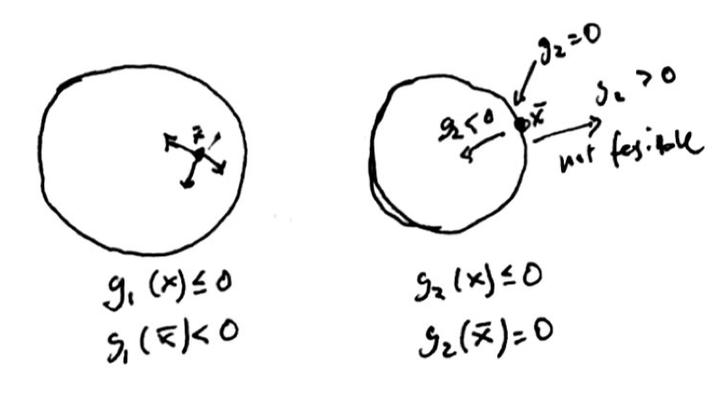
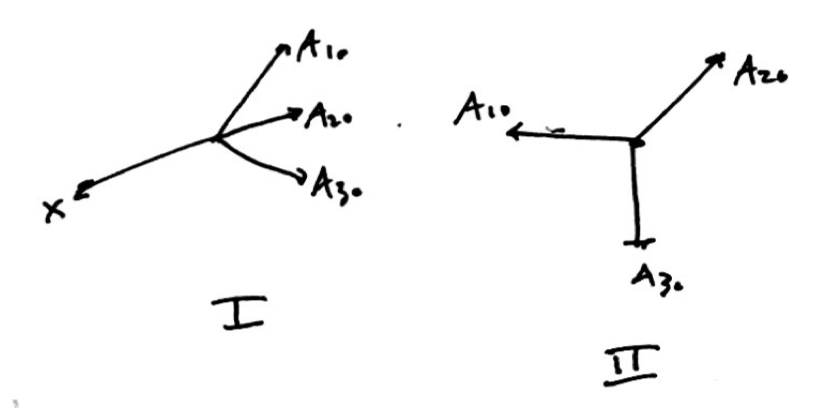

---
title:  'Nonlinear Optimization Lecture 10'
date: Tuesday, February 16, 2016
author: Garrick Aden-Buie
...

# Last Time Review

- $f$ convex: $\bar x \min \Leftrightarrow \nabla f(\bar x)^T (x - \bar x) \geq 0\;\forall x \in S$
- $D$ feasible directions
- $F$ improving directions
- $F_0 \colon \nabla f(\bar x)^T d < 0$
- $\bar x$ local min $\Rightarrow F \cap D = \emptyset$
    - The converse is true ($\Leftarrow$) when $f$ is pseudoconvex

# Lemma

$$\begin{aligned}
\text{min}	&&&f(x)	& 	& \\
\text{s.t}	&&&g_i(x) \leq 0		&	&i = 1, \dots, m \\
\end{aligned}$$

Let $S = \{ x \in \mathbb{R}^n \colon g_i(x) \leq 0,\; i = 1, \dots, m \}$, $\bar x \in S$

Define $I = \{ i \colon g_i(\bar x) = 0 \}$, called the *index set for binding constraints*.
There are $m$ number of inequality constraints but some of them are binding (active, tight) but some of them are non-binding.

Assume that $g_i \colon i \in I$ are differentiable at $\bar x$.
And that $g_i \colon i \not\in I$ are continuous at $\bar x$.

$G_0 = \{ d \colon [\nabla g_i(\bar x)]^T d <0 \;\forall i \in I \}$ for all binding constraints.

Then (this is the lemma) $G_0 \subset D$[^1].

[^1]: $D$ is the set of *all* feasible directions, but $G_0$ is a limited set of feasible directions from boundary points.

Note that $\nabla g_i(\bar x) d$ gives the descent direction for $g_i$.

*Remark.* If $g_i \colon i \in I$ *strictly* pseudoconvex at $\bar x$, then $G_0 = D$.

- Convexity not needed for the following, just differentiability
    - $F_0 \subset F$
    - $G_0 \subset G$
- $\bar x$ local min $\begin{matrix}\Rightarrow F \cap D = \emptyset \\ &\Rightarrow F_0 \cap G_0 = \emptyset \end{matrix}$

# Theorems of Alternatives

## Farkas' Lemma (Theorem 2.4.5 in textbook)

Given, $A \in \mathbb{R}^{m \times n},\; c \in \mathbb{R}^n$, then exactly one of the following is true (I $\Leftrightarrow \neg$ II).

I.  $Ax \leq 0,\; c^t x > 0$ for some $x \in \mathbb{R}^n$

    - Inner-product of $Ax$ is less than 0, $c^T x > 0$ implies that $c$ and $x$ have an acute angle.

II.  $A^T y = c, \; y \geq 0$ for some $y \in \mathbb{R}^m$

    - $c$ can be represented as a linear combination of the row vectors of $A$, and $y \geq 0$ means that it must be a non-negative linear combination.

*Remark.* This is directly related to $\bar x$ local min $\Rightarrow F_0 \cap G_0 = \emptyset$

## Gordon's Lemma

Exactly one of the following is true:

I.  $Ax < 0$ for some $x \in \mathbb{R}^n$

II.  $A^T y = 0$ for some $y \geq 0, y \neq 0, y \in \mathbb{R}^m$

*Proof.* I. Let

$$\begin{aligned}
e &= \begin{bmatrix} 1 \\ \vdots \\ 1 \end{bmatrix} \in \mathbb{R}^m \\
\hat c &= \begin{bmatrix} 0 \\ \vdots \\ 0 \\ 1 \end{bmatrix} \in \mathbb{R}^{n+1} \\
\hat A &= \begin{bmatrix} A & e \end{bmatrix} \\
\hat x &= \begin{bmatrix} x \\ s \end{bmatrix}
\end{aligned}$$

Farkas' lemma: I. $$\hat A \hat x\leq 0, \hat c^T \hat x > 0 \Rightarrow \begin{bmatrix} A & e \end{bmatrix} \begin{bmatrix} x \\ s \end{bmatrix} = Ax + es \leq 0$$

But notice then that $Ax < 0$, which is equivalent to system I from Gordon's lemma.

For II, let $$\hat A^T y = \hat c,\; y \geq 0 \Rightarrow \begin{bmatrix} A & e \end{bmatrix}^T y = \begin{bmatrix} 0 \\ \vdots \\ 0 \\ 1 \end{bmatrix} \Rightarrow A^T y = 0,\; e^T y = 1$$

So Farkas' system II and Gordon's system II are equivalent.

# Fritz-John Optimality Conditions

## Theorem

$$\begin{aligned}
\text{min}	&&&f(x)	& 	& \\
\text{s.t}	&&&g_i(x) \leq 0		&	&i = 1, \dots, m \\
\end{aligned}$$

- $g_i \colon i \in I$ differentiable at $\bar x$
- $g_i \colon i \not\in I$ continuous at $\bar x$
- $f$ differentiable at $\bar x$

If $\bar x$ local min, then $\exists u_0, u_i \colon i \in I$ such that $$u_0 \nabla f(\bar x) + \sum_{i \in I} u_i \nabla g_i(\bar x) = 0$$ for $u_0, u_i \colon i \in I \geq 0$ and $(u_0, u_i \colon i \in I) \neq 0$[^2].

[^2]: There are many $u_i$ and at least one of them must be non-zero and they are non-negative.

Furthermore, if $g_i$ is differentiable at $\bar x$ for $i = 1, \dots, m$, then we can say that if $\bar x$ is a local minimum, then $\exists u_i \colon i = 0, 1, \dots, m$ such that

$$\begin{aligned}
u_0 \nabla f(\bar x) + \sum_{i = 1}^m u_i \nabla g_i (\bar x)  &= 0 &&\\
u_i g_i(\bar x) &= 0 &&i = 1, \dots, m \\
u_i &\geq 0 &&i = 0, 1, \dots, m \\
(u_i \colon 0, 1, \dots, m) &\neq 0
\end{aligned}$$

Lines 3 and 4 above are called complimentary conditions.

*Proof.* Let

$$A = \begin{bmatrix} \nabla f(\bar x)^T  \\ \nabla g_i (\bar x)^T \; i \in I\end{bmatrix}$$

Using Gordon's lemma, system I, where we use $d$ instead of $x$.
System I implies that $\exists d \colon Ad < 0$, $\nabla f(\bar x)^T d < 0$ and $\nabla g_i(\bar x)^T d < 0\;\forall i \in I$.

This means that $\exists d \colon d \in F_0, \exists d \colon d \in G_0$. Then $\exists d \colon d \in F_0 \cap G_0$.
And then finally, this means that $F_0 \cap G_0 \neq \emptyset$.

System II says that $\Rightarrow y \colon y \neq 0,\; A^T y = 0$.
Let $$y = \begin{bmatrix} u_0 \\ u_i \colon i \in I \end{bmatrix}$$

$$\begin{aligned}
A^T y = u_0 \nabla f(\bar x) + \sum_{i \in I} u_i \nabla g_i(\bar x) &= 0 \\
u_i &\geq 0 &&i = 0, 1, \dots, m \\
(u_i \colon 0, 1, \dots, m) \neq 0
\end{aligned}$$

Then $\Rightarrow \bar x$ is a Fritz-John point (but we don't know if it's a local minimum or not yet).

Summarizing, I: $F_0 \cap G_0 \neq \emptyset$ and II: $\bar x$ Fritz-John point.

$$\begin{aligned}
\bar x \text{ local min } &\Rightarrow F \cap D = \emptyset \\
&\Rightarrow F_0 \cap G_0 = \emptyset \\
&\Leftrightarrow \text{ not I} \\
&\Leftrightarrow \text{II} \\
&\Leftrightarrow \bar x \text{ is a F-J point}
\end{aligned}$$

# Karush-Kuhn-Tucker (KKT) Conditions

$$\begin{aligned}
\text{min}	&&&f(x)	& 	& \\
\text{s.t}	&&&g_i(x) \leq 0		&	&i = 1, \dots, m \\
\end{aligned}$$

Let $\bar x$ feasible and $f, g_i \colon i \in I$ are differentiable at $\bar x$ and $g_i \colon i \not\in I$ are continuous at $\bar x$

If $\nabla g_i(\bar x) \colon i \in I$ are linearly independent and $\bar x$ is a local minimum, then $\exists u_i \colon i \in I$ such that $$\nabla f(\bar x) + \sum_{i \in I} \nabla g_i(\bar x) = 0$$ where $u_i \geq 0\;\forall i$.

Now we can say that if $\bar x$ is a local minimum $\Leftrightarrow \bar x$ is a Fritz-John point and $\Leftrightarrow \bar x$ is a KKT point under constraint qualtifications.

If $g_i\;\forall i = 1, \dots, m$ are differentiable, KKT conditions are

$$\begin{aligned}
\nabla f(\bar x) + \sum_{i \in I}^m u_i \nabla g_i(\bar x) &= 0 \\
u_i g_i(\bar x) &= 0 &&\forall i = 1, \dots, m \\
u_i &\geq 0 && \forall i = 1, \dots, m \\
\bar x \text{ is feasible}& \\
\end{aligned}$$
