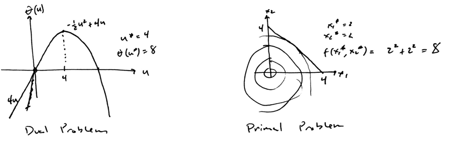

---
title:  'Nonlinear Optimization Lecture 12'
date: Tuesday, February 23, 2016
author: Garrick Aden-Buie
...

# Last time

Necessary condition means that if $\bar x$ is a minimum then the condition will hold, while sufficient condition means that if the condition is true then $\bar x$ is a minimum.

We've discussed unconstrained ($\nabla f(\bar x) = 0$) and constrained (KKT conditions) problems.
In the previous class we derived the KKT conditions.
So today we will discuss *duality* and then next week we will discuss *algorithms* and then we will move into *game theory* the week after.

# Lagrangian Duality

The optimization problem is called the *primal problem*.

$$\begin{aligned}
\text{min}	&&&f(x)	& 	& \\
\text{s.t}	&&&g_i(x) \leq 0 		&& i = 1, \dots, m \\
            &&&h_j(x) = 0 && j = 1,\dots,l \\
            &&&x \in X &&
\end{aligned}$$

and any primal problem has a corresponding *Dual Problem*

$$\begin{aligned}
\max_{u,v}	&&&\theta (u, v)	&& \\
\text{s.t}	&&&u \geq 0		&& \\
\end{aligned}$$

where there are no constraints on $v$ and where $$\theta(u,v) = \min_{x \in X} \left\{f(x) + \sum_{i=1}^m u_i g_i(x) + \sum_{j=1}^l v_j h_j (x) \right\}$$ which is called the *Lagrangian*, sometimes denoted as $L(x,u,v)$.

To be more precise, the max and min from the dual problem need to be $\sup$ or *supremum* (smallest upper bound), and the min needs to be $\inf$ or *infimum* (largest lower bound).
For example, if we had a set $A = \{1, 2, 3, 3.4, 3.9, 3.9999, 3.999999 \}$, the set $A$ approaches 4 but $\max A$ cannot be 4, because $4 \not\in A$, but $\sup A = 4$.

In vector form, the Lagrangian is $$\theta(u,v) = \min_{x \in X} \left\{f(x) + g(x)^T u + h(x) ^T v \right\}$$

## Example

$$\begin{aligned}
\text{min}	&&&x_1^2 + x_2^2	& 	& \\
\text{s.t}	&&&-x_1 - x_2 + 4 \leq 0		&	&\to g \\
            &&&x_1, x_2 \geq 0 &&\to X
\end{aligned}$$

$$\begin{aligned}
L(x,u) &= f(x) + u g(x) \\
&= x_1^2 + x_2^2 + u (-x_1 - x_2 - 4) \\
\theta(u,v) &= \inf_{x \in X} \left\{ L(x, u) \right\} \\
&= \inf_{x \in X} \left\{ x_1^2 + x_2^2 + u (-x_1 - x_2 - 4) \right\} \\
&= \inf_{x_1 \geq 0} \left\{x_1^2 - u x_1 \right\} + \inf_{x_2 \geq 0} \left\{ x_2^2 - u x_2 \right\} + 4u
\end{aligned}$$

Considering first $\inf_{x_1 \geq 0} \{x_1^2 - u x_1 \}$, if $u \geq 0 \Rightarrow x_1 = \frac u 2$ and if $u < 0 \Rightarrow x_1 = 0$.
Then, doing the same for $x_2$ gives $$\theta(u) = \begin{cases} -\frac 1 2 u^2 + 4u, &\text{if } u \geq 0 \\ 4u, &\text{if } u < 0 \end{cases}$$

Where, finally, the solution to the dual is $u^* = 4$ which gives $\theta(u^*) = 8$.

# Theorem

$\theta(u,v)$ is a concave function of $(u,v)$.

*Proof.* In the case of LP duality. The primal problem is written as

$$\begin{matrix}
\text{Primal} & \text{Dual} \\
\begin{aligned}
\min_x	&&&c^T x	& 	& \\
\text{s.t}	&&&A x \geq b		&	& \\
            &&&x \geq 0 &&\\
\end{aligned} & \begin{aligned}
\max_w	&&&b^T w	& 	& \\
\text{s.t}	&&&A^T w \geq c		&	& \\
            &&&w \geq 0
\end{aligned}
\end{matrix}$$

To show that the dual can be obtained from the primal:

$$\begin{matrix}
\textit{Primal} & \textit{Dual} \\
\begin{aligned}
\text{min}	&&&f(x) = c^T x	& 	& \\
\text{s.t}	&&&g(x) = b - Ax \leq 0		&	& \\
&&&x \in X = \{x \geq 0 \} &&\\
\end{aligned} & \begin{aligned}
\max\;\; &\theta(u) \\
\text{s.t.}\;\; &u \geq 0 \\
\theta(u) &= \min_{x \in X} \lbrace f(x) + u^T g(x) \rbrace \\
&= \min_{x \geq 0} \lbrace c^T x + u^T (b - Ax) \rbrace \\
&= u^T b + \min_{x \geq 0} \lbrace (c - A^T u)^T x \rbrace \\
\min_x \{\dots\}&= \begin{cases} 0, &\text{if } c-A^T u \geq 0 \\ -\infty, &\text{otherwise} \end{cases} \\
\theta(u) &= \begin{cases} u^T b, &\text{if } c - A^t u \geq 0 \\ -\infty, &\text{otherwise} \end{cases} \\
\Rightarrow \max \;\;&u^t b \\
\text{s.t.} \;\;&c - A^T u \geq 0 \\
&u \geq 0
\end{aligned}\end{matrix}$$

# Weak Duality Theorem

Let $\bar x$ be feasible to the primal problem (P) and $\bar u, \bar v$ be feasible to the dual (D).
Then, $$f(\bar x) \geq \theta (\bar u, \bar v)$$

Or in general, $f(x) \geq \theta(u,v)$ for all $x \in X \colon g(x) \leq 0,\; h(x) = 0,\; u \geq 0,\; v$ free.

## Corollary 1

$$\begin{aligned}
\inf \left\{ f(x) \colon x \in X, g(x) \leq 0, h(x) = 0 \right\} &&\geq&&& \sup \left\{ \theta(u, v) \colon u \geq 0 \right\}
\end{aligned}$$

*Intuitively:* the minimization problem (on the left) must have a value that moves downward towards the maximization problem (on the right) that is also moving upward towards the minimization problem.
They should meet in the middle, but the min problem should be greater than the max problem.

## Corollary 2

- If $f(\bar x) = \theta(\bar u, \bar v)$ and $\bar x \in X, g(\bar x) \leq 0, h(\bar x) = 0, \bar u \geq 0$

- Then $\bar x$ solves (P) and $\bar u, \bar v$ solves (D).

*Intuitively:* if you just look through possibilities and you find one where (P) = (D) and the point is feasible in both, then you've solved the problem.

# Strong Duality Theorem

*Motivation.* Despite Corollary 2 above, there can easily be situations where an optimal solution exists for both (P) and (D) but that these function values are different.

- If $f$ and $g$ are convex functions, $X$ is a convex set, and Slater's CQ holds[^1]...
- Then there is no duality gap, i.e. $f(x^*) = \theta(u^*, v^*)$.
- In general, $f(x^*) \geq \theta(u^*, v^*)$.

[^1]: See Lecture 11 from 2016-02-18.

# Danskin's Theorem (1966)

Consider $Z \subset \mathbb{R}^m$ compact (closed and bounded), and a function $\phi \colon \mathbb{R}^n \times Z \to \mathbb{R}$ continuous and the function $\rho(x) = \inf_{z \in Z} \phi (x, z)$.

In other words, you minimize a function $\phi$ over the set $Z$, whose result is summarized in $\rho(x)$.
Notice that if $x$ changes, $z$ changes, so you can kind of write $z$ as $z(x)$ or $\phi = (x, z(x))$.

Then, $\rho^\prime (x; d) = \inf_{z \in Z(x)} \phi^\prime (x,z; d)$, which is the directional derivative of $\rho$ and where $Z(x) = \{\bar z \colon \phi(x, \bar z) = \inf_{z \in Z} (x, z) \}$

The set $Z$ is a collection of $\bar z$s, so $Z$ is the collection of optimal solutions as $x$ changes, so $Z$ is the collection of all optimal solutions.
Then if $x$ is fixed, then for a given $x$ we solve $\phi$ and take the derivative of all of the solutions collected in $\phi$, and then take the minimum.
It's like differentiation passes through the infimum operator, but this only works when $Z$ compact and $\phi$ is continuous.

If $Z(x)$ is a singleton, $\{\bar z (x) \}$, then we can show that $$\nabla \rho (x) = \nabla_x \phi (x, z) \vert_{z = \bar z (x)}$$

Here, $\nabla_x$ indicates the partial derivative of $\phi$ with respect to $x$, and then $\vert_{z}$ indicates that after obtaining the partial derivative, simply plug in $z = \bar z (x)$.

The proof is difficult and omitted, but the application is as follows:

## Theorem

$$\begin{matrix}
\begin{aligned}
\min &&& f(x) \\
&&&g(x) \leq 0	& 	& \\
\text{s.t}	&&&h(x) = 0		&	& \\
&&&x \in X
\end{aligned} & \begin{aligned}
w &= \begin{bmatrix}u \\ v \end{bmatrix} \\
\beta(x) &= \begin{bmatrix}g(x) \\ h(x) \end{bmatrix} \\
\theta(w) &= \inf_{x \in X} \left\{ f(x) + w^T \beta(x) \right\}
\end{aligned}
\end{matrix}$$

- **If** $X$ is a non-empty compact set.
- Suppose $X(\bar w)$ is the singleton $\{\bar x\}$
- where $X(w) \left\{\bar x \colon f(\bar x) + w^T \beta(\bar x) = \inf \{f(x) + w^T \beta(x)\}\right\}$
- **Then** $\theta(w)$ is differentiable at $\bar w$ and $\nabla \theta(\bar w) = \beta (\bar x)$.

This theorem says that if $X$ is a singleton, then we know that a derivative exists, and $\beta(\bar x)$ is the gradient of $\theta(\bar w)$.

If $X$ is *not* a singleton, then $\theta$ may not be differentiable, but $\beta(\bar x)$ is a subgradient of $\theta(\bar w)$, which is also a good thing.
