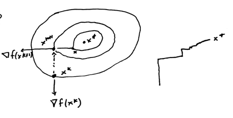

# Multi-Dimensional Search

There are two variations: without derivative and with derivative.

## Cyclic Search

Deal with each dimension one-by-one.
Consider you have $f(x_1, x_2)$ and you are at $(x_1^k, x_2^k)$, then $\min_{x_1}f(x_1, x_2^k)$.
Then switch, and search over $x_2$ setting $x_1^{k+1}$ fixed as the solution from the previous step.

This method tends to be slow, but generally works as a fall-back.

## Steepest Descent

At $x^k$, we want direction $d^k = - \nabla f(x^k)$

$$x^{k+1} = x^k - \lambda_k \nabla f(x^k)$$

$\lambda_k$: step size, $\lambda_k > 0$.

$$\min_{\lambda \geq 0} f\left(x^k - \lambda \nabla f(x^k)\right)$$

From here we can use the line search algorithm to solve the above equation, because $x^{k}$ and $\nabla f(x^{k})$ are fixed, only $\lambda$ is variable.
So use line search to solve the above problem, at every step to find a new $\lambda$.

This algorithm is also quite slow; it may be fast at the beginning but then it's slow in the final steps.

## Some other methods for unconstrained problems

- BFGS
    - A class of methods similar to steepest descent with additional terms added
- Conjugate Gradient (CG)

---

# Constrained Optimization

## Penalty Function Method

$$\begin{aligned}
\text{min}	&&&f(x)	& 	& \\
\text{s.t}	&&&x \in X		&	& \\
\end{aligned}$$

Define a penalty function $p(x)$ such that

(1) $p(x)$ continuous $\forall x$
(2) $p(x) \geq 0 \;\forall x$
(3) $p(x) = 0 \Leftrightarrow x \in X$

### Examples

$$\begin{aligned}
g_i(x) \leq 0 &\Rightarrow p(x) = \left\lbrack \max \{0, g_i(x) \} \right\rbrack^P \\
h_i(x) = 0 &\Rightarrow p(x) = \left\vert h_i(x) \right\vert^p
\end{aligned}$$

where $p$ is a positive number, usually $p = 2$.

$p = 1$
:    $p(x) = \max\{0, g_i(x) \}$ non differentiable

$p = 2$
:    $p(x)$ is differentiable

$$\begin{matrix}
\begin{aligned}
\text{min}	&&&f(x)	& 	& \\
\text{s.t}	&&&g_i(x) \leq 0		&	&i = 1, \dots, m \\
&&&h_j(x) = 0 &&j = 1, \dots, l
\end{aligned}
&
\Rightarrow
&
\begin{aligned}
\text{min}	&&&f(x) + \mu p(x)	&& \\
\text{where}	&&&p(x) = \sum_{i = 1}^m \left\lbrack \max \{0, g_i(x) \}\right\rbrack^p + \sum_{j=1}^l \left\vert h_j(x) \right\vert^p		&	& \\
\end{aligned}
\end{matrix}$$

Where $\mu$ small infeasible and $\mu$ large feasible.

\clearpage

## SUMT: Successive Unconstrained Minimization Technique

- Begin with small $\mu_k > 0$
- Solve $\min f(x) + \mu_k p(x)$ with initial solution being $x_k$.
- Obtain $x_{k+1}$
- Increase $\mu_k$ by some factor and set $k = k+1$
- Repeat.

### Example

$$\begin{aligned}
\text{min}	&&&x^2	& 	& \\
\text{s.t}	&&&x \geq 1		&	& \\
\\
\min &&&x^2 + \mu \left\lbrack \max(0, 1-x) \right\rbrack^2 \\
&&&=\begin{cases} x^2 & x \geq 1 \\ x^2 + \mu(1 - x)^2 &x < 1  \end{cases} \\
\end{aligned}$$

Let $r(x) = x^2 + \mu (1 - x)^2$, then $r^\prime(x) = 2x - 2\mu (1 - x) = 0 \Rightarrow x_\mu = \frac{\mu}{1 - \mu} < 1$.
And $x_{\mu} \to 1$ as $\mu \to \infty$.

Note that in this method, you never have a feasible solution.
The way this method works, you start outside the feasible set and work your way to a feasible solution.
