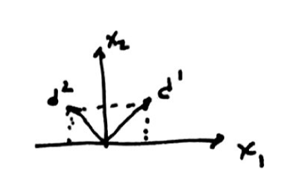
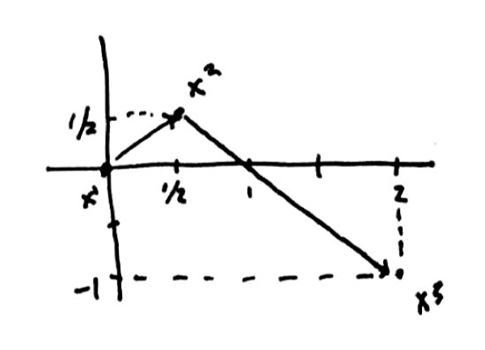
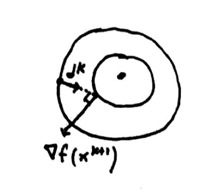

---
title:  'Nonlinear Optimization Lecture 19'
date: Thursday, March 31, 2016
author: Garrick Aden-Buie
...

# H-Conjugate Directions

$$\begin{aligned}
(d^i)^T H d^j &= 0 \\
f(x) &= c^T x \frac 1 2 x^t H x \\
x &= x^1 + \sum_{j=1}^n \lambda_j d^j \\
F(\lambda) &= \sum F_j (\lambda_j) \\
\text{If } H \;\text{is PD,} \\
\lambda_j^* &= \frac{c^T d^j + {d^j}^T H x_1}{{d^j}^T H d^j}
\end{aligned}$$

## Example

$$\begin{aligned}
\min f(x) &= -12 x_2 4x_1^2 + 4x_2^2 + 4x_1x_2 \\
\nabla f &= \begin{bmatrix} 8x_1 + 4x_2 \\ -12 + 8 x_2 + 4x_1 \end{bmatrix} \\
H(x) &= \begin{bmatrix} 8 & 4 \\ 4 & 8 \end{bmatrix}
\end{aligned}$$

Two conjugate directions

$$\begin{aligned}
d^1 &= \begin{bmatrix} 1 \\ 1 \end{bmatrix} \\
d^2 &= \begin{bmatrix} a \\ b \end{bmatrix} = \begin{bmatrix} -1 \\ 1 \end{bmatrix} \\
(d^1)^T H d^2 &= \begin{bmatrix} 1 & 1 \end{bmatrix} \begin{bmatrix} 8 & 4 \\ 4 & 8 \end{bmatrix} \begin{bmatrix} a \\ b \end{bmatrix} \\
&=\begin{bmatrix} 12 & 12 \end{bmatrix}\begin{bmatrix} a \\ b \end{bmatrix} = 0 \\
\text{Choose } x^1 &= \begin{bmatrix} 0 \\ 0 \end{bmatrix}
\end{aligned}$$

$$\begin{aligned}
f(x) &= c^T x + \frac 1 2 x^T H x \\
&= \begin{bmatrix} 0 & -12 \end{bmatrix} x + \frac 1 2 x^T \begin{bmatrix} 8 & 4 \\ 4 & 8 \end{bmatrix} x \\
\lambda_1^* &= \frac 1 2 \\
\lambda_2^* &= -\frac{3}{2} \\
x^2 &= x^1 + \lambda_1 d^1 \\
&= \begin{bmatrix} 0 && 0 \end{bmatrix} + \frac 1 2 \begin{bmatrix} 1 \\ 1 \end{bmatrix} = \begin{bmatrix} \frac 1 2 \\ \frac 1 2 \end{bmatrix} \\
x^3 &= x^2 + \lambda_2 d^2 \\
&= \begin{bmatrix} \frac 1 2 \\ \frac 1 2 \end{bmatrix} + -\frac{3}{2} \begin{bmatrix} -1 \\ 1 \end{bmatrix} = \begin{bmatrix} 2 \\ -1 \end{bmatrix}
\end{aligned}$$

If H is PD, we know that we will reach the optimal solution after $n$ iterations (at least for quadratic optimization).

*Remark.* DFP applied to a quadratic function generates $H$-conjugate directions.

# Fletcher-Reeves Conjugate Gradient Method (CG)

- $x^{k+1} = x^k + \lambda_k d^k$
- Start with $d^1 = - \nabla f(x^1)$
- $d^{k+1} = -\nabla f(x^{k+1}) + \alpha_k d^k$ where $\alpha_k$ is a weight based on the previous iteration.

How to determine $\alpha_k$?
A: Use line search.
But we will be designing the algorithm so that we can generate conjugate directions.

Consider the following quadratic function.

$$\begin{aligned}
f(x) &= c^T x + \frac{1}{2} x^T H x \\
\nabla f(x) &= c + Hx \\
\nabla f(x^{k+1}) - \nabla f(x^k) &= H(x^{k+1} - x^k) \\
\nabla f(x^{k+1}) &= \nabla f(x^k) + H(x^{k+1} - x^k) \\
&= \nabla f(x^k) + \lambda_k H d^k \\
\nabla f(x^{k+1})d^k &= 0 \;\text{when an exact line search is used} \\
\end{aligned}$$

Using the definition of $d^{k+1}$

$$\begin{aligned}
\left(\nabla f(x^{k+1}) \right)^T \nabla f(x^k) &= \left(\nabla f(x^{k+1})) \right)^T \left\lbrack \alpha_{k-1}d^{k-1} - d^k \right\rbrack \\
&= \alpha_{k-1} \nabla f(x^{k+1})^T d^{k-1} - \nabla f(x^{k+1})^T d^k \\
&= \alpha_{k-1} \nabla f(x^{k+1})^T d^{k-1} - 0 \\
&= \alpha_{k-1} \left\lbrack \nabla f(x^k) + \lambda_k H d^k \right\rbrack^T d^{k-1} \\
&= \alpha_{k-1} \nabla f(x^k)^T d^{k-1} + \alpha_{k-1} \lambda_k (d^k)^T H d^{k-1} \\
&= 0 + \alpha_{k-1} \lambda_k (d^k)^T H d^{k-1}
\end{aligned}$$

We want $\lambda_k (d^k)^T H d^{k-1}$ to be equal to 0, so that $\left(\nabla f(x^{k+1})) \right)^T \nabla f(x^k) = 0$.

$$\begin{aligned}
\nabla f(x^k)^T d^k &= \nabla f(x^k) \left( -\nabla f(x^k) + \alpha_{k-1}d^{k-1} \right) \\
&= -\Vert \nabla f(x^k) \Vert^2 + \alpha_{k-1} \nabla f(x^k)^T d^{k-1} \\
&= -\Vert \nabla f(x^k) \Vert^2 + \alpha_{k-1} 0 \\
&= -\Vert \nabla f(x^k) \Vert^2
\end{aligned}$$

From $(d^k)^T H d^{k+1}$ and $x^{k+1} = x^k + \lambda_k d^k$ we want the following to equal 0

$$\begin{aligned}
\frac{1}{\lambda_k} (x^{k+1} x^k)^T H d^{k+1} &= 0 \\
&= \frac{1}{\lambda_k} (\nabla f(x^{k+1}) - \nabla f(x^k))^T d^{k+1} \\
\text{Using again the definition of } d^{k+1} \\
&= \frac{1}{\lambda_k} \left( - \Vert \nabla f(x^{k+1}) \Vert^2 + \alpha_k \nabla f(x^{k+1})^T d^k + \nabla f(x^k)\nabla f(x^{k+1}) - \alpha_k \nabla f(x^k)^T d^k \right) \\
&= \frac{1}{\lambda_k} \left( - \Vert \nabla f(x^{k+1}) \Vert^2 + \alpha_k 0 + 0 - \alpha_k (-\Vert \nabla f(x^k)\Vert^2) \right) \\
&= \frac{1}{\lambda_k} \left( -\Vert \nabla f(x^{k+1}) \Vert^2 + \alpha_k \Vert \nabla f(x^k) \Vert^2 \right) \\
&= 0
\end{aligned}$$

Then this gives that we should set $$\alpha_k = \frac{\Vert \nabla f(x^{k+1}) \Vert^2}{\Vert \nabla f(x^{k}) \Vert^2}$$

In summary:

1. Start at $x^1$, and start with $d^1 = -\nabla f(x^1)$.
2. Find $x^2$.
3. Use $x^2, x^1$ to find $\alpha_1$
4. Use $x^2, \alpha_1, d^1$ to find $d^2$.
5. Use $x^2, d^2$ to find $x^3$.
6. Repeat.

***

# Game theory

We now begin the third part of the course: game theory^[The first two parts were theory and algorithms.]

- Cournot Games
    - Mathematical Games
    - $N$-player Games
    - Non-cooperative Games

## Non-cooperative Behavior

Each player $i = 1, \dots, N$ chooses a strategy $x^1$ (a vector of decision variables for player $i$), where $x^i \in X_i$ (a set of feasible strategies), which maximizes his or her utility level, $u_i$.

$$u_i(x^1, x^2, \dots, x^{i-1}, x^i, x^{i+1}, \dots, x^N)$$

This function determines the overall utility, but the only variables that are under the control of player $i$ are the $x^i$.
In other words, the utility for player $i$ is dependent on the decisions of others, but they can only control their own decisions.
To denote the *not*-$i$ decisions we use $-i$.

$$u_i(x^i, x^{-i})$$

where $x^{-1} = (x^j)_{j \neq i}$.

## Nash Equilibrium

**...of an $N$-person non-cooperative game**

For this portion,

$$\begin{aligned}
x &= (x^i)^N_{i=1} \\
X &= \prod_{i=1}^n X_i = X_1 \times X_2 \times \cdots \times X_n
\end{aligned}$$

Where $\times$ is called the cartesian product.

> Then, a *Nash Equilibrium* $x^* \in X$, describing all strategies of all players, of the game is defined as a point at which no player can unilaterally increase his/her utility.
>
> $$u_i (x^{i*}, x^{-i*}) \geq u_i(x^i, x^{-i*})\;\;\;\forall x^i \in X_i,\; i = 1, \dots, N$$
